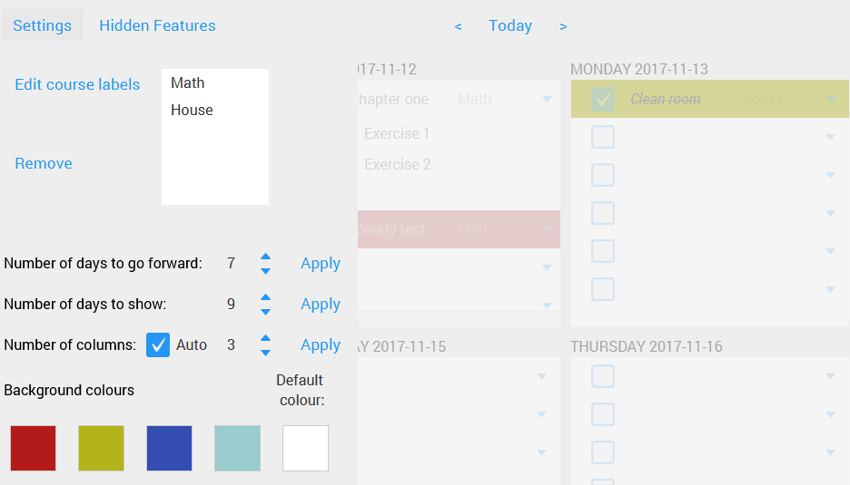

|BuildStatus| |DocumentationStatus|

====
Plep
====

Plepping is the new planning.

Plep works like a real agenda, but with the advantages of your Windows
computer.

Downloads
---------

Latest stable version:

.. image:: https://img.shields.io/github/release/deltadak/plep.svg?maxAge=2592000
    :target: https://github.com/deltadak/plep/releases/latest
    :alt: Release
Latest pre-release version:

.. image:: https://img.shields.io/github/release/deltadak/plep/all.svg?maxAge=2592000
    :target: https://github.com/deltadak/plep/releases
    :alt: Pre-release
|
We try to adhere to `Semantic Versioning`_. An update with a new first
number means it won’t work with your old database.

Features
--------

-  Drag and drop
-  Custom labels
-  Subtasks
-  Custom colours
-  Repeat for x weeks
-  Customize number of days and columns
-  Turn pages by a custom amount of days
-  Deletion and undoing deletion
-  Plep will remember all deleted tasks until you close it.

Note: The first time plep is ran, it will create a database file in the
folder where the jar is stored. Check for this file, otherwise your data
won’t be saved. You can backup this if you don’t want to lose your data.

Screenshot of v2.0.0
--------------------

|screenshot|

Settings of v2.0.0
------------------

|screenshotSettings|

Instructions for building from source in IntelliJ
-------------------------------------------------

Make sure you have JavaFX installed, for example on Arch Linux you can install the ``java-openjfx`` package.

-  To run or debug, use the Gradle task ``run``.
-  To build an executable jar, use the task ``build``, the file is then
   in ``build/libs/``.

Building a Windows release
--------------------------

-  Run the gradle task launch4j/createExe
-  Open InnoSetup on the setup file in ``releasing/Windows/innoSetup/PlepInstaller.iss``
-  Update the version number
-  Click Build \| Compile

`Javadoc (obsolete)`_
---------------------

Badges with thanks to `shields.io <https://shields.io/>`_.

.. _Download latest version: https://github.com/deltadak/plep/releases
.. _Download stable version v1.2.2.: https://github.com/deltadak/plep/releases/download/v1.2.2/plep_v1.2.2.jar
.. _Download the experimental windows installer for v1.2.1.: https://github.com/deltadak/plep/releases/download/v1.2.1/setup_plep_v1.2.1.exe
.. _Semantic Versioning: http://semver.org/
.. _Javadoc (obsolete): http://htmlpreview.github.io/?https://github.com/deltadak/plep/blob/master/Javadoc/index.html

.. |BuildStatus| image:: https://travis-ci.org/deltadak/plep.svg?branch=master
    :target: https://travis-ci.org/deltadak/plep
    :alt: Build Status
.. |DocumentationStatus| image:: https://readthedocs.org/projects/plep/badge/?version=latest
    :target: http://plep.readthedocs.io/en/latest/?badge=latest
    :alt: Documentation Status
.. |OpenHub| image:: https://www.openhub.net/p/plep/widgets/project_thin_badge.gif
    :target: https://www.openhub.net/p/plep
    :alt: OpenHub
.. |screenshot| image:: screenshots/v2.0.0-beta.5.PNG
